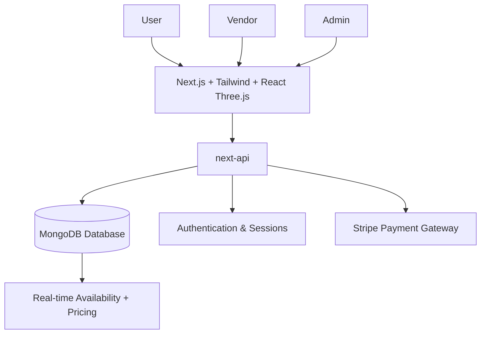

# 🎟️ Universal Ticket Booking System (Blue Tag)

<p align="center">
  <b>A unified platform for booking buses, trains, movies, events, and hotels — all in one place.</b><br>
  Built with modern full-stack technologies, 3D UI, and secure payments.
</p>

<p align="center">
  

</p>

---

## ✨ Features
- 🔎 **Search & Filter** – intuitive search with advanced filtering  
- ⏱️ **Real-Time Availability** – live seat & room updates  
- 💸 **Dynamic Pricing** – adaptive fares based on demand  
- 👤 **User Authentication** – secure login & profile management  
- 📜 **Booking History** – past & upcoming reservations at a glance  
- 🎨 **3D Interactive UI** – immersive experience powered by React Three.js  
- 💳 **Stripe Payments** – secure, seamless ticket purchase flow  
- 🏪 **Vendor Dashboard** – vendors can list and manage events, movies, or shows  
- 🛡️ **Admin Panel** – admins approve/disapprove listings, manage users, and monitor system health  
- 📱 **Responsive UI** – optimized for desktop & mobile
  
---

## 🛠️ Tech Stack
<p align="center">
  
</p>


---

## 🏗️ Architecture


---

## 🚀 Getting Started

### 1️⃣ Clone the Repository
```bash
git clone https://github.com/yourusername/ticket-booking.git
cd ticket-booking
```

### 2️⃣ Install Dependencies
```bash
npm install
```

### 3️⃣ Configure Environment Variables
Create a `.env` file in the root directory:
```env
MONGO_URI=your-mongodb-uri
JWT_SECRET=your-secret-key
STRIPE_SECRET_KEY=your-stripe-secret
STRIPE_PUBLIC_KEY=your-stripe-public
```

### 4️⃣ Run the App
```bash
npm run dev
```
App will be running at: **http://localhost:3000**

---

## 📸 Screenshots
<p align="center">
  
  
  
  


</p>

---

## 📊 Project Highlights
- **Unified System** – one app to handle multiple booking domains  
- **3D Visualizations** – interactive UI powered by React Three.js  
- **Secure Payments** – Stripe integration for real-world checkout  
- **Vendor Management** – vendors can create & manage events  
- **Admin Control** – admins moderate events, movies, users, and transactions  
- **Scalable Backend** – built with Node.js & Express  
- **Cloud-Ready** – deployable on Vercel / AWS / Heroku  
- **Database-Driven** – MongoDB for real-time booking and pricing
  
---

## 🤝 Contributing
Contributions are welcome!  
- Fork the repo  
- Create a feature branch  
- Submit a pull request  

---

## 📜 License
Distributed under the MIT License. See `LICENSE` for more information.

---

## 🌐 Connect with Me
<p align="center">
  <a href="https://www.linkedin.com/in/gautham-sriram-bb0b89334/"></a>
  <a href="mailto:gauthamsriram16@gmail.com"></a>
  <a href="https://github.com/Gthamsrim1"></a>
</p>
